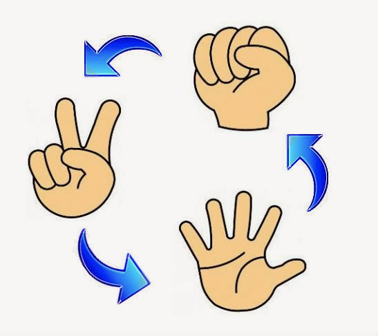
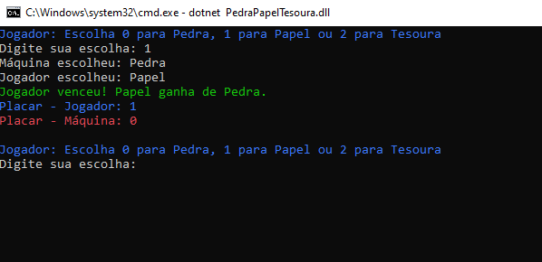
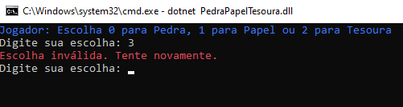
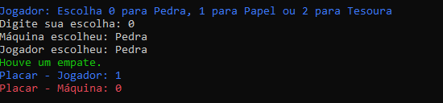

# ✂ PEDRA, PAPEL E TESOURA ✂

*VOCÊ JÁ JOGOU PEDRA, PAPEL E TESOURA?*

Pedra, papel e tesoura, também chamado em algumas regiões do Brasil de jokenpô, é um jogo de mãos recreativo e simples para duas ou mais pessoas, que não requer equipamentos nem habilidade.

**COMO FUNCIONA:** 

- Pedra ganha da tesoura (amassando-a ou quebrando-a).
- Tesoura ganha do papel (cortando-o).
- Papel ganha da pedra (embrulhando-a).



## COMO O JOGO FUNCIONA?

Primeiramente para que você possa jogar, é preciso baixar o programa.

Após a inicialização do seu programa, você poderá joga-lo com a máquina, disputando assim, uma partida de "Pedra, Papel e Tesoura" onde o primeiro a marcar 5 pontos vence.

**COMO JOGAR?**

Para jogar use **0** para pedra, **1** para papel e **2** para tesoura. A jogada humana é feita via teclado e a IA realiza uma jogada aleatória.



Logo após o jogador selecionar um número, automaticamente a jogada da máquina é realizada.

O jogador NÃO pode selecionar um número diferente de (0, 1 ou 2), se não irá aparecer a seguinte mensagem "Escolha inválida. Tente novamente.".



A disputa entre o Jogador e a Máquina encerra quando um dos dois atingir 5 vitórias.

- Em caso de empate, a rodada se repete.



Após ter um ganhador, você pode jogar novamente quantas vezes quiser.

## COMO BAIXAR?

Para realizar o download do jogo, clique no link abaixo:

**[CLIQUE AQUI ✂](dist/PedraPapelTesoura.rar)** 

Após a instalação do programa, você precisará extrair os arquivos para "PedraPapelTesoura", se estiver utilizando o Windows, poderá se direcionar para pasta e executar o arquivo (.exe), caso seja outro Sistema Operacional poderá executar o arquivo (.dll).

```
dotnet PedraPapelTesoura.dll
```

Utilize esse comando para executar o programa em formato (.dll).

- Preferência utilizar o Prompt ou Powershell.

## CRIADO POR:

[Gabriel Henrique](https://github.com/GabrielHenri7) 

[Eduarda Bianchi](https://github.com/EduardaRospendowiski)


